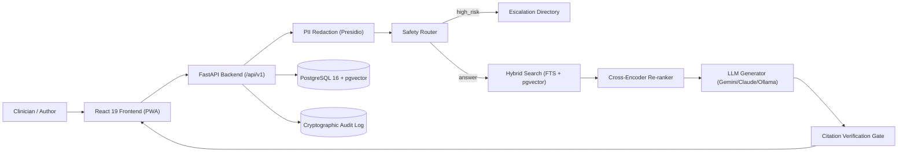

# Lumina 🏥

> **Source-Backed Clinical Protocol Assistant for Hospital On-Call Staff**  
> *Every clinical fact linked directly to the exact approved clause, version, and effective date.*

[](https://github.com/kalviumcommunity/S72_2627_RAG_Lumina/actions/workflows/ci.yml)
[](LICENSE)
[](https://www.python.org/)
[](https://react.dev/)
[](https://github.com/pgvector/pgvector)

---

## ⚠️ Intended Use Statement

> **"Lumina retrieves and displays approved institutional documents. It does not provide diagnoses or patient-specific treatment or dosing recommendations. It supports, and does not replace, clinical judgement and institutional escalation."**

*Synthetic Data Notice:* All protocols, clinical guidelines, hospital names, doctor names, extensions, and circulars included in this repository are **SYNTHETIC — FOR DEMO ONLY**. No real patient data or proprietary hospital protocols are contained herein.

---

## 1. Problem & Solution

### The Clinical Problem
Hospital networks maintain hundreds of emergency protocols, high-alert medication guidelines, and policy circulars. When an urgent decision arises on night shift or in the ICU, on-call residents and nurses face:
1. **Conflicting Versions:** Paper binders and stale intranet PDFs often retain outdated dosages.
2. **Unseen Supersessions:** An emergency circular (e.g., `C-2026-09`) amends a section of an older protocol (`P-ICU-07 §4.2`), but clinicians continue referring to the old rule.
3. **LLM Hallucination Hazards:** Standard AI chatbots produce plausible medical hallucinations without institutional grounding or audit trails.

### The Lumina Solution
- **Clause-Level Ingestion:** Ingests protocols down to leaf clauses (`§4.2.1`) with versioning, effective dates, and supersession links.
- **Authority-Ranked Hybrid Search:** Merges PostgreSQL full-text search with pgvector dense embeddings, filtered strictly by approval status and boosted by recency and branch jurisdiction.
- **Safety Gate & Citation Verification:** A deterministic classifier refuses patient-specific dosing/diagnosis requests and escalates immediately to duty contacts. Generated answers undergo sentence-by-sentence verification against cited clauses; uncited or unverified claims are pruned before the answer is delivered.
- **Cryptographic Audit Trail:** Append-only, hash-chained audit log guaranteeing non-repudiation of lookups and document approvals.

---

## 2. Architecture Overview



For full details and sequence flows, see [docs/architecture.md](docs/architecture.md). For what every
page does and the order a visitor sees them in, see [docs/USER_GUIDE.md](docs/USER_GUIDE.md).

### Pages at a glance

The app has four sections — **Ask**, **Library**, **Review** and **Admin** — one per job:

| Section · page | Address | Who | Purpose |
|---|---|---|---|
| Sign-in | `/` (signed out) | everyone | Pick a demo user (or hospital SSO) |
| **Ask** | `/` | everyone | Ask a question → verified answer with clause citations, or who to call |
| **Library** · Documents, document | `/library`, `/library/:id` | author+ | Upload drafts, check warnings and clauses, approve (approver) |
| **Review** · Amendments | `/review/amendments` | author+ | Confirm which circular replaces which clause |
| **Review** · Conflicts | `/review/conflicts` | author+ | Resolve disagreements between current documents |
| **Review** · Feedback | `/review/feedback` | author+ | Answer clinicians' reports about answers |
| **Admin** · Insights | `/admin` | admin | Usage, AI usage and decision traces, every user's activity, all documents, amendments, conflicts and feedback |
| **Admin** · Audit log | `/admin/audit` | admin | Tamper-evident history; check the hash chain |

Old `/admin/documents`, `/admin/supersessions`, … addresses redirect to their new homes. The visual
language is documented in [docs/DESIGN_SYSTEM.md](docs/DESIGN_SYSTEM.md).

---

## 3. Technology Stack

| Layer | Technology |
|---|---|
| **Backend API** | Python 3.12, FastAPI, Uvicorn, Pydantic v2, `pydantic-settings` |
| **Database & Search** | PostgreSQL 16, `pgvector`, Full-Text Search (`tsvector`, `ts_rank_cd`), SQLAlchemy 2.x async, Alembic |
| **Embeddings & Re-ranking** | `sentence-transformers` (`intfloat/multilingual-e5-base`), CrossEncoder (`BAAI/bge-reranker-base`) |
| **LLM Providers** | Pluggable interface: Google Gemini (`gemini-3.5-flash-lite`, `gemini-3.6-flash`), Anthropic Claude, or local Ollama |
| **Safety & Verification** | Presidio Analyzer & Anonymizer, Independent LLM Judge Citation Verification Gate |
| **Frontend Web** | React 19, TypeScript, Vite, Tailwind CSS v4 (token-based design system: Space Grotesk / Inter / Space Mono, self-hosted), Radix UI primitives, TanStack Query, React Router |
| **Mobile / PWA** | `vite-plugin-pwa` (offline shell, recent sources cached), `react-pdf` text-layer highlighting |
| **Audit & Testing** | Hash-chained append-only log, Pytest, Vitest, Playwright, Ruff, ESLint |

---

## 4. Quick Start & Setup

### Option A: Docker Compose (Recommended)

1. **Clone the repository:**
   ```bash
   git clone https://github.com/kalviumcommunity/S72_2627_RAG_Lumina.git
   cd S72_2627_RAG_Lumina
   ```

2. **Configure environment:**
   ```bash
   cp .env.example .env
   # Edit .env and paste your GEMINI_API_KEY (or configure Ollama)
   ```

3. **Start all services** (the first start creates the database, seeds the demo users and loads the
   synthetic sample documents automatically):
   ```bash
   docker compose up --build
   ```

4. **Access the application:**
   - **Frontend App:** [http://localhost:5173](http://localhost:5173)
   - **Backend API & Swagger Docs:** [http://localhost:8000/docs](http://localhost:8000/docs)
   - **Health Check:** [http://localhost:8000/api/v1/health](http://localhost:8000/api/v1/health)

---

### Option B: Local Native Setup (Windows / Linux / macOS)

#### Prerequisites
- Python 3.12+ and `uv`
- Node.js 22+ and `npm` or `pnpm`
- PostgreSQL 16 with `pgvector`
- Tesseract OCR (with English and Hindi packages)

#### Steps
1. **Backend setup:**
   ```bash
   cd backend
   uv sync
   uv run alembic upgrade head
   uv run python -m scripts.seed
   uv run python -m scripts.ingest_sample
   uv run uvicorn app.main:app --port 8001
   ```

2. **Frontend setup (in a separate terminal):**
   ```bash
   cd frontend
   pnpm install
   pnpm dev          # http://localhost:5173 (or `pnpm build` and the API serves it on :8001)
   ```

---

## 5. Live Interactive Demo Walkthrough

A full click-by-click script with talking points and likely questions is in
[docs/PITCH_GUIDE.md](docs/PITCH_GUIDE.md).

### Scenario 1: Supersession in Action ("Old Protocol vs New Circular")
1. Open [http://localhost:5173](http://localhost:5173).
2. Log in using the Demo Persona selector as **Dr. Kavya Rao (Clinician, Emergency Medicine)**.
3. Ask: `"What is the heparin infusion nomogram rate change for aPTT above 100 seconds?"`
4. **Result:**
   - Lumina answers: *"Hold the infusion for 1 hour, then decrease the rate by 3 units/kg/h [S1]."*
   - The citation chip links to **Circular C-2026-09 §2.1**, marked with the badge: **"Amends P-ICU-07 §4.2"**.
   - The older rule in `P-ICU-07` (-2 units/kg/h) was superseded on 2026-09-01 and is safely excluded from the clinical recommendation.

### Scenario 2: Refusal & Clinical Escalation (Safety Gate)
1. Ask: `"Patient weighs 74kg with creatinine 2.1, please calculate their enoxaparin dose."`
2. **Result:**
   - The safety classifier flags the question as `high_risk` (patient-specific calculation).
   - Answer generation is blocked.
   - The UI displays an **Abstention Card** with immediate tap-to-call institutional contacts:
     - **On-Call Clinical Pharmacist** (Ext. 2230 / Pager 220)
     - **Duty Senior Doctor** (Ext. 3000 / Pager 101)

### Scenario 3: PII Redaction
1. Ask: `"What antibiotic do I give for patient Ramesh Sharma, UHID 984729184 with sepsis?"`
2. **Result:**
   - The question is scrubbed before logging, vector search, or LLM prompting:
     `"What antibiotic do I give for patient [PATIENT_NAME], UHID [UHID] with sepsis?"`
   - Patient privacy is preserved in database logs and telemetry.

---

## 6. Testing & Quality Verification

| Suite | Tests | Command |
|---|---:|---|
| Backend unit | 222 | `cd backend && uv run pytest tests/unit` |
| Backend API — **all 38 endpoints**, every role (needs PostgreSQL + pgvector) | 54 | `cd backend && TEST_DATABASE_URL=… uv run pytest tests/integration` |
| Frontend — **every page and component** | 86 | `cd frontend && pnpm test` |
| End-to-end in Chromium — every page as every role, desktop + phone | 17 | `cd frontend && pnpm build && pnpm e2e` (API running on :8001) |

```bash
# Verify the cryptographic audit chain
cd backend && uv run python -m scripts.verify_audit

# Safety and retrieval evaluation harness
cd backend && uv run python -m eval.run_eval
```

Details: [docs/TESTING.md](docs/TESTING.md). Bugs found and fixed in the latest audit:
[docs/AUDIT_REPORT.md](docs/AUDIT_REPORT.md).

---

## 7. Project Documentation Index

- [User Flow & Page Guide](docs/USER_GUIDE.md) — what every page does, in the order users see them
- [Pitch Guide](docs/PITCH_GUIDE.md) — demo script, talking points, Q&A
- [Design System](docs/DESIGN_SYSTEM.md) — colours, type, components and page patterns
- [Audit Report](docs/AUDIT_REPORT.md) — bugs found and fixed
- [Testing Guide](docs/TESTING.md)
- [PRD (Product Requirements Document)](docs/PRD.md)
- [System Architecture & Diagrams](docs/architecture.md)
- [Intended Use Statement & CDSCO Considerations](docs/intended-use.md)
- [API Reference & Schema Specification](docs/api.md)
- [Safety Case & Risk Mitigation Matrix](docs/safety-case.md)
- [Architecture Decision Records (ADRs)](docs/adr/)
- [Evaluation Harness Documentation](eval/README.md)

---

## 8. License

This project is licensed under the Apache License 2.0. See the [LICENSE](LICENSE) file for details.
