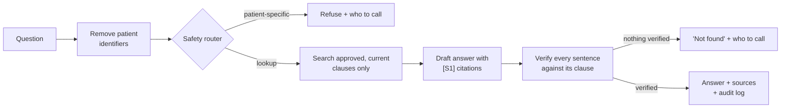

# Lumina — Pitch Guide

Everything needed to present Lumina: the story, the setup, a click-by-click demo with what to say,
and answers to the questions you are likely to get. Every demo step below was run against the
sample corpus while preparing this guide.

---

## 1. The 30-second pitch

> On night shift, a resident needs the heparin rate for an aPTT above 100. The ICU protocol says one
> thing — but a circular issued three weeks ago changed that exact clause. Paper binders and old PDFs
> don't know that. A general chatbot will confidently make something up.
>
> **Lumina answers only from the hospital's approved, current documents.** Every sentence links to the
> exact clause, version and effective date. Superseded text is never used. Anything it cannot prove
> from a source is deleted before the clinician sees it. And if the question is about a specific
> patient — a dose for a 72 kg man — it refuses and shows who to call.

## 2. Problem → solution

| Problem on the ward | What Lumina does |
|---|---|
| Hundreds of protocols, guidelines and circulars in binders, PDFs and intranets | One question box over every **approved** document, with the clause cited |
| A circular amends §4.2 of a protocol, but the old text is still in circulation | **Amendments** are tracked per clause; amended clauses disappear from answers on the effective date |
| Two current documents disagree (6 h vs 4 h) | Both values shown side by side with dates — never silently picked — and the owner is notified |
| AI chatbots invent plausible doses | Every sentence must cite a source; a **verifier** deletes unsupported sentences and any number not in the source |
| Staff type patient names and IDs | Identifiers are removed before anything is logged, searched or sent to an AI model |
| "Who approved this, and when?" | Draft → approval workflow and a tamper-evident, hash-chained **audit log** |

## 3. How it works (one picture)



Say it like this: *"Search is hybrid — keywords plus meaning — and filtered by authority: only the
approved version in force today, for your branch, minus anything a circular has replaced. The AI only
drafts; a separate check deletes every sentence the cited clause does not support. If the AI is slow
or down, each step falls back to a deterministic version, so clinicians still get a safe answer."*

---

## 4. Before the pitch (15 minutes)

**Recommended: Docker.**

```bash
cp .env.example .env          # put your GEMINI_API_KEY in .env — or set LLM_PROVIDER=none for verbatim-quote answers
docker compose up --build     # first start downloads the search models and loads the sample documents
```

Open **http://localhost:5173**. Check **http://localhost:8000/api/v1/health** shows `"status":"ok"`.

**Native alternative** (Python 3.12 + uv, Node 22 + pnpm, PostgreSQL 16 with pgvector, Tesseract):

```bash
cd backend && uv sync && uv run python -m scripts.bootstrap      # schema + demo users + sample documents
cd ../frontend && pnpm install && pnpm build                       # the API serves this build
cd ../backend && uv run uvicorn app.main:app --port 8001           # open http://localhost:8001
```

**Checklist**

- [ ] Health is `ok` (`degraded` means the AI model is unreachable — check the key, or use `LLM_PROVIDER=none`);
      the sign-in page lists 9 demo users.
- [ ] Ask the first example once as a warm-up (the first question loads the models).
- [ ] For a clean slate: Docker `docker compose down -v && docker compose up --build`; native
      `uv run python -m scripts.reset_db --yes && uv run python -m scripts.bootstrap`.
- [ ] The demo documents are dated around September 2026 (C-2026-14 takes effect 28 Sept 2026), so the
      demo works on the real date. For a native run you can pin the date with `TODAY_OVERRIDE=2026-09-30`
      in `.env`.
- [ ] Browser zoom 110–125 % so the audience can read it.

---

## 5. Demo script (about 7 minutes)

### Step 0 — Sign-in page (30 s)
*Show:* the headline "Answers you can trace to the clause.", the three principles, and the dark
"Choose a demo user" panel — users grouped by role, each with one line saying what it can do.
*Say:* "Four roles. Clinicians only ask questions. Authors upload documents, approvers approve them,
administrators see everything. In a hospital this is single sign-on; for the demo we pick a user."

### Step 1 — The newest rule wins (1 min) · clinician **Dr Kavya Rao**
*Click:* example **"What is the heparin nomogram step for aPTT above 100?"**
*Show:* the answer cites **C-2026-09** and the source line says **Amends P-ICU-07 §4.2**. Click the
**S1** chip — the source viewer opens the circular with the cited clause highlighted.
*Say:* "The protocol from 2025 still exists, but this circular replaced section 4.2 on 1 September.
Lumina never cites the replaced clause. One click shows exactly where the answer came from."

### Step 2 — Honest about disagreement (45 s)
*Click:* **"When should aPTT be repeated after a heparin rate change?"**
*Show:* **⚠ Approved documents disagree** — P-ICU-07 says 6 hours, DG-02 says 4 hours; the newer one is
marked **More recent**; "Flagged to the document owner".
*Say:* "Lumina does not pick a winner in a clinical disagreement. It shows both, with dates, and tells
the owner to fix the documents."

### Step 3 — It knows when not to answer (45 s)
*Click:* **"What heparin bolus should I give Mr Ramesh Kumar, 72 kg?"**
*Show:* the question bubble now reads **"…give &lt;PERSON&gt;, 72 kg?"**; **This needs a clinical decision**;
**Call** buttons for the duty doctor and the on-call pharmacist.
*Say:* "Patient-specific dosing is a clinical decision. Rules catch it before any AI sees it — and the
patient's name was removed before anything was logged."

### Step 4 — Scanned documents and brand names (30 s, optional)
- **"How soon should antibiotics be given for possible sepsis without shock?"** → answered from
  **C-2026-11**, a *scanned* PDF read with OCR (the source viewer shows the OCR confidence).
- **"Does Tazocin need AMS approval?"** → "Tazocin" is expanded to piperacillin-tazobactam; today
  DG-01 lists it as **unrestricted**. Remember this answer for step 5.

### Step 5 — Approval changes the answer (1 min 30) · approver **Dr Sana Qureshi**
*Click:* Sign out → **Dr Sana Qureshi** → **Library** → **Awaiting approval** → **C-2026-14** →
**Approve**. The dialog lists the amendments found in the text (DG-01 §3.1 and §3.2) — keep "Also
confirm these amendments" ticked → **Approve**.
*Then:* Sign out → **Dr Kavya Rao** → ask **"Does Tazocin need AMS approval?"** again.
*Show:* now **"Restricted agents need AMS pharmacist or ID consultant approval within 24 hours…"**,
citing **C-2026-14**, which amends DG-01 §3.1.
*Say:* "Drafts are invisible to clinicians. The moment an approver signs off, the very next answer uses
it — and the old clause is gone."

### Step 6 — Same question, different hospital (30 s, optional)
Sign in as **Dr Arjun Iyer (Riverside)** and ask **"Who do I call to activate the massive transfusion
protocol?"** → Riverside's own SOP: **extension 4410**. At Central (Dr Kavya Rao) the same question
gives the blood bank on **extension 2210**. *"Local arrangements override network-wide ones, per branch."*

### Step 7 — Show the machinery (1 min 30) · administrator **Nikhil Desai**
*Click:* **Admin** (opens **Insights**).
- **Overview** (the numbers on the green band) — questions, % answered with citations, % declined *by design*, response times, work
  waiting (drafts, amendments, conflicts, feedback), questions no document covers (gaps to write).
- **AI usage** — the model and its settings, how many statements were verified vs removed, which
  layer decided each route. Open **Trace** on the Tazocin question: route and reason, abbreviations
  expanded, how the answer was drafted, statements kept/removed and why, timings per step.
- **Users** — every user's activity: questions, refusals, feedback, uploads, approvals.
- **Documents / Amendments / Conflicts / Feedback** — every record in one place.
*Then:* the **Audit log** tab → **Check chain** → **Chain intact**.

*If asked "where does an author work?":* the **Review** section — Amendments, Conflicts and Feedback
tabs, each showing how many items are waiting.
*Say:* "Every question, answer and approval is in a hash-chained log. Change one row and the chain
breaks — and the database refuses edits anyway."

---

## 6. Numbers worth quoting

| | |
|---|---|
| Safety layers per question | 5 — identifier removal, safety router, authority filter, relevance gate, sentence verifier |
| Verifier threshold | a sentence is kept only if its cited clause supports it (score ≥ 0.8) and every number in it appears in the source |
| Stage time budgets | classify 6 s · generate 15 s · verify 10 s — past that, a deterministic fallback takes over |
| Roles | 4 (clinician, author, approver, administrator) |
| Sample corpus | 9 documents, 11 versions: protocols, drug guidelines, circulars (one scanned), a branch SOP |
| Tests | 276 backend (all 38 API endpoints, every role), 86 frontend (every page and component), 17 end-to-end browser tests |

---

## 7. Questions you may get

**"How do you stop it hallucinating?"** The model never answers from memory: it only sees retrieved
clauses and must cite one per sentence. A separate verifier then checks every sentence against the
clause it cites; uncited sentences, sentences the clause does not support, and any number not in the
source are deleted. If nothing survives, Lumina says "not found" and shows who to call.

**"What if the AI service is down or slow?"** Each AI step has a time budget and a deterministic
fallback: rules for routing, verbatim quotes for the answer, a strict word-level check for
verification. Lumina can run with no AI model at all — it then quotes the documents verbatim.

**"Where does patient data go?"** Identifiers are removed first, so logs, search and AI prompts only
ever see the redacted question. For full data residency the AI can run on-premises (Ollama) or in an
Indian cloud region (Vertex AI).

**"How does it know which version applies?"** Each document has versions with effective dates; only
the approved version in force today is searchable. Amendment links hide replaced clauses from their
effective date. Drafts and retired versions are never used.

**"Why not just use ChatGPT?"** It doesn't know your hospital's documents, can't tell current from
superseded, can't prove where an answer came from, and has no approval workflow or audit trail.

**"Is this a medical device?"** It is a retrieval tool: it displays approved institutional documents
and refuses patient-specific decisions (see [intended-use.md](intended-use.md)). Accepting patient
parameters to recommend doses would need clinical validation and regulatory review.

**"How do documents get in?"** An author uploads Markdown, PDF (scanned pages are OCR'd), Word or HTML.
Lumina splits it into clauses, indexes it, reads the header, flags low OCR confidence for a human check
and suggests amendment links from phrases like "amends P-ICU-07 §4.2". An approver approves.

**"Which AI models?"** Any of Google Gemini (default; a fast model for routing and checking, a
stronger one for writing), Anthropic Claude, or a local model via Ollama. Search uses open models
(multilingual E5 embeddings and a BGE re-ranker) that run on the server.

**"How do you know it works?"** Every API endpoint is tested with every role; the question pipeline is
tested end to end, including a test that injects a fabricated dose and proves it never reaches the
clinician; browser tests walk every page as every role. There is also an evaluation harness
(`eval/`) for retrieval recall, groundedness and correct abstention.

## 8. Be accurate about

- The documents are **synthetic** — say so.
- Lumina does not diagnose or dose; it shows what approved documents say.
- Log retention (`LOG_RETENTION_DAYS`) is configured but the automatic purge is not built yet.
- Answer wording depends on the models configured; the sources, refusals and verification do not.
