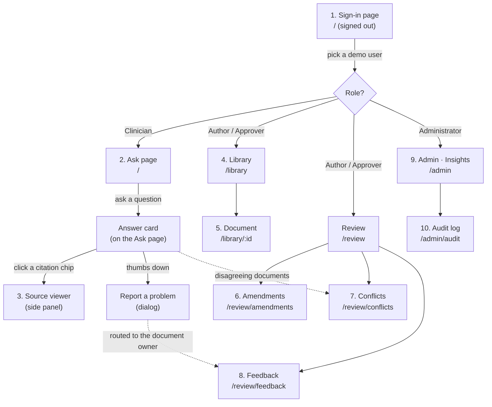

# Lumina — User Flow and Page Guide

This guide walks through Lumina the way a visitor experiences it: which page opens first, where each
click leads, and what every page is for. Every page has **one job**; the sections below say what that
job is, what is on the page and which role can open it.

> Demo data is **synthetic** (a fictional "Demo Health Network" with three branches). Nothing here is
> clinical guidance.

---

## 1. The map

### Who sees what

| Page | Clinician | Author | Approver | Administrator |
|---|:---:|:---:|:---:|:---:|
| Sign-in | ✓ | ✓ | ✓ | ✓ |
| Ask (+ source viewer, feedback) | ✓ | ✓ | ✓ | ✓ |
| **Library** — documents, document detail, upload | — | ✓ | ✓ | ✓ |
| Approve / retire a version, confirm amendments | — | — | ✓ | ✓ |
| **Review** — Amendments, Conflicts, Feedback | — | ✓ | ✓ | ✓ |
| **Admin** — Insights (usage, AI, users, all records) | — | — | — | ✓ |
| **Admin** — Audit log, API reference | — | — | — | ✓ |

Roles are ordered: **clinician → author → approver → administrator**; each role can do everything the
previous one can. A page a role may not open shows "Not available for your role" (the server refuses
the data as well, so hiding the link is not the only protection).

### How the app is organised

The app has **four sections**, one per job, and the top navigation has one entry per section:

| Section | Address | Who | What it is for |
|---|---|---|---|
| **Ask** | `/` | everyone | Ask a question, read the cited answer, open the source. |
| **Library** | `/library` | author + | Every document and its versions; upload and approve. |
| **Review** | `/review/…` | author + | The three work queues: Amendments, Conflicts, Feedback. |
| **Admin** | `/admin`, `/admin/audit` | administrator | Insights (usage, AI, users, all records), Audit log, API reference. |

Review and Admin have a second row of pill tabs under the header. The Review tabs show how many items
are waiting in each queue (for example **Conflicts 1**), so an author sees at a glance where work is.

### On every page

- **Announcement bar** — a black strip at the very top: "Demo environment — every document is
  synthetic…". It can be dismissed for the session.
- **Header** — the "Lumina" wordmark (goes to Ask), the sections your role can open, your name, role
  and branch, and **Sign out**. Clinicians have only Ask, so they see no navigation at all. On a phone
  the sections move into a menu button.
- **Footer** — the intended-use statement: Lumina shows approved documents; it does not diagnose or
  give patient-specific doses, and it does not replace clinical judgement. It stays visible on every
  screen.
- **Skip to content** — the first Tab press on any page jumps past the navigation (keyboard users).
- **If a page fails to draw** it shows "This page could not be shown" with a **Reload** button instead
  of a blank screen; moving to another page recovers.
- **Auto sign-out** — after 15 minutes without activity (shared ward computers). The session lives in
  the browser tab only, so closing the tab also signs out.

---

## 2. Sign-in page — the first page

**Address:** any address while signed out. **Job:** choose who you are.

- The headline promise, **"Answers you can trace to the clause."**, and one sentence on what Lumina does.
- Three principles: *Every sentence is cited*, *Only what is in force*, *Knows when not to answer*.
- **Choose a demo user** (dark panel on the right) — the seeded users grouped by role, each role with a
  sentence saying what it can do. One click signs in.
- **Sign in with hospital SSO** — shown only when an OIDC identity provider is configured (production).
- Which answer model is running, and the intended-use statement in the dark footer band.

After sign-in everyone lands on **Ask**.

---

## 3. Ask page — the clinician's page

**Address:** `/`. **Job:** ask a question and get an answer you can trust, or be told who to call.

### Before asking
- Title **"Ask the approved protocols"** and one sentence explaining the promise.
- **Try an example** — six demo questions; each one shows a different safety behaviour (the coral tag
  on the right names it: Amendment, Branch, Refusal…).
- **Your recent questions** — your last five questions, stored only with identifiers removed. Click to
  ask again.
- **The question box** pinned to the bottom (Enter to send, Shift+Enter for a new line). Under it: "Do
  not type patient names or IDs — they are removed automatically."

### While Lumina works
One line shows the step in progress: *Checking the question → Finding approved sources → Checking
every statement against its source* (step n of 3). **Stop** cancels.

### The answer card
| Part | What it tells the clinician |
|---|---|
| Header | **Verified against sources** (every statement checked), **Partly verified** (some statements were removed because the source did not support them) or **No answer given**, plus "n of n statements checked". |
| Identifier notice | If a name, UHID, phone number etc. was typed, the redacted question actually used, e.g. "What heparin bolus should I give &lt;PERSON&gt;, 72 kg?" |
| **⚠ Approved documents disagree** | Two current documents give different values. Both are shown side by side with version and date; the newer one is marked **More recent**. Lumina never picks one. The disagreement is sent to the document owner. |
| Answer text | Short sentences, each ending in a citation chip such as **S1**. Hover shows the clause; click opens it. |
| Key values | The doses/times/thresholds copied from the source (each opens its clause). |
| Sources cited | Document code, section, heading, title, version, effective date, and **Amends P-ICU-07 §4.2** when the source is a circular that replaced an older clause. |
| Footer | "Supports, does not replace, clinical judgement." plus **👍 Helpful** and **Report a problem**. |

### When Lumina does not answer
| Case | What is shown |
|---|---|
| **Patient-specific request** (a weight, a creatinine value, "should I give…", a named patient) | Black-bordered box: *This needs a clinical decision, not a document lookup*, and **Escalate to** contacts with **Call** buttons (duty doctor for your branch, clinical pharmacist, CCOT…). |
| **Not covered by an approved document** | *No approved document covers this* + contacts. Lumina never guesses. |
| **Too vague** ("dose?") | *One more detail is needed*, the clarifying question, and **Add the detail** (puts your question back in the box). |
| **Out of scope** ("capital of France") | *Outside Lumina's scope*. |

### Report a problem (dialog)
Choose **Wrong**, **Outdated** or **Unhelpful**, add an optional comment. The report goes to the owner
of the cited document (or an administrator) and appears on their **Feedback** page.

---

## 4. Source viewer — opens from any citation

**Opens as:** a side panel (desktop) or bottom sheet (phone). **Job:** prove the answer — show the
exact clause inside its whole document.

- Title: document code and section (e.g. **C-2026-09 §2**), document title below.
- Badges: version and effective date, "Current version", document type, review date (or "Review overdue
  by n days"), OCR confidence for scanned documents.
- Banners when relevant: **superseded by** a newer amendment, **a newer version is in force**, or
  **this document amends** another.
- The whole document, clause by clause, with the **cited clause highlighted** and scrolled into view.
- Scanned/PDF documents get a second tab, **Original page**, showing the page image with the clause
  outlined.
- **Open original** downloads the approved file.

---

## 5. Library — author, approver, admin

**Address:** `/library` (page title "Documents"). **Job:** see every document and its state; add new ones.

- Search by code or title; status pills **All**, **Awaiting approval (n)**, **Review overdue (n)** (the
  choice is kept in the address, e.g. `/library?filter=pending`, so it can be bookmarked or linked
  from the Admin page); type pills **Protocol, Drug guideline, Circular, SOP, External reference**.
- One row per document: code and title, type/department/branches, **in force** version and since
  when, status (Approved, "n awaiting approval", Processing), review due date (red, with days overdue, when late),
  owner. Click a row to open it.
- **Upload document** opens the upload dialog:
  - choose a file (Markdown, PDF — scanned pages are OCR'd — Word or HTML);
  - **Read details from the file** fills code, title, version, effective and review dates from the
    document's header table;
  - pick department and branches (network-wide or specific branches);
  - **Upload as draft**. Nothing reaches clinicians until an approver approves it.

## 6. Document

**Address:** `/library/:id`. **Job:** manage one document's versions.

- **← Library** back link; header with code, type chip, title, department, owner, branches;
  **Upload new version**.
- A banner if another document amends this one ("Amended by C-2026-09 v1 (§4.2)").
- One card per version: status (Draft / Approved / Superseded / Retired), **In force** marker,
  effective and review dates, file name, approval time, number of clauses indexed, parser, pages, OCR
  confidence, and any **warnings**:
  - *metadata mismatch* — the file's header says a different code/version/date than the form;
  - *low OCR confidence* — an author must click **I've checked the OCR text** before approval.
- Actions: **Approve** (approvers; the dialog lists amendments detected in the text and can confirm
  them at the same time), **Re-process**, **Retire** (approvers), **Show indexed clauses** (exactly
  what the search engine sees).
- "Sections this document amends" lists its amendment links.

## 7. Review → Amendments

**Address:** `/review/amendments` (`/review` opens here). **Job:** control which old clauses stop being used.

When an uploaded circular says it *amends / replaces / supersedes* a clause of another document,
Lumina suggests a link. Approvers review it here.

- **Needs review** — suggested links with the sentence that triggered them, what they will hide, and
  **Confirm** / **Reject** (approvers).
- **In force** — confirmed links; from their effective date the amended clauses never appear in answers.
- **Add amendment link** — record one by hand (source version → target document and section → date).

## 8. Review → Conflicts

**Address:** `/review/conflicts`. **Job:** fix disagreements between current documents.

- Each conflict shows what differs, then both clauses side by side as **Source A** and **Source B**, how it was found (while answering a question, or when
  a document was approved), confidence, and owner.
- **Resolve** (with a note of what will change) or **Dismiss** (with the reason it is not a real
  conflict). Until then, clinicians see the ⚠ banner with both values.
- **Open / All** switch.

## 9. Review → Feedback

**Address:** `/review/feedback`. **Job:** answer clinicians' reports.

- Each report: kind (wrong / outdated / not helpful), status, who reported it and when, who it was
  routed to, the question (identifiers removed), the answer that was given, the comment and the cited
  clauses.
- **Acknowledge** and **Resolve** (with a note). Authors see the reports routed to them;
  administrators see all.

---

## 10. Admin → Insights — administrator only

**Address:** `/admin`. **Job:** everything an administrator needs to understand and show the system, on
one page. Choose **7 / 30 / 90 days** (the previous numbers stay on screen, dimmed, while the new window
loads). The headline numbers sit on a dark green band; the daily chart has a legend, a hover/keyboard
read-out for each day (arrow keys) and **Show as table**.

| Tab | What it shows |
|---|---|
| **Overview** | Questions asked, % answered with citations, % declined (by design when evidence is missing), median and 95th-percentile response time; work waiting for someone (versions awaiting approval, amendments to review, open conflicts, open feedback — each links to its page); questions per day (answered vs declined); how questions were handled and why answers were declined; questions no document covers (gaps to write new guidance for); most asked questions; most cited documents; documents overdue for review. |
| **AI usage** | How the AI is set up (answer model and provider, reasoning/"thinking" level, embedding model, re-ranker, identifier-removal engine, verifier mode and threshold, minimum relevance, prompt versions); statements verified (kept vs removed); answers written by the AI vs quoted verbatim; questions with identifiers removed; who decided each route (safety rules vs AI classifier); average time per pipeline step; AI model calls since the server started (per step: calls, failures, time-outs, average time); and **Recent decisions** — each question with its result; **Trace** opens the full reasoning trail: route + reason + which layer decided, key terms and abbreviations expanded, how the answer was drafted, how many statements the verifier kept, the statements it **removed and why**, what was cited, and per-step timings. |
| **Users** | Every user: role, branch, questions, answered, escalated, refused (patient-specific), feedback given, uploads, approvals, reviews, last active. |
| **Documents** | Every document with its in-force version, drafts, owner and review date (overdue marked). |
| **Amendments** | Every amendment link: amending document → replaced section, date, in force / needs review, and the evidence sentence. |
| **Conflicts** | Every conflict, its status, how it was found and the owner. |
| **Feedback** | Every piece of feedback from every user, including 👍. |

The tabs are read-only; each links to the page where the work is done.

## 11. Admin → Audit log — administrator only

**Address:** `/admin/audit`. (Admin → **API reference** opens the interactive API docs at `/docs` in a
new tab.) **Job:** prove what happened.

- Every question, answer, sign-in, upload, approval, amendment, conflict and feedback action, newest
  first, with who did it and a short hash. **Details** shows the full entry and the hash link.
- Filters: date range and kind of action. **Export CSV**.
- **Check chain** re-computes every hash: "Chain intact — all n entries link correctly", or the first
  entry that was altered. (The database also refuses edits and deletions of audit rows.)

---

## 12. Each role's journey in one paragraph

**Clinician (Dr Kavya Rao, Central):** signs in → Ask → types or picks a question → reads the verified
answer → clicks **S1** to see the clause in its document → gives 👍 or reports a problem. If the
question is about a specific patient, Lumina refuses and shows who to call.

**Author (Dr Meera Nair):** Library → **Upload document** → reads details from the file → uploads a
draft → watches it process → checks warnings and clauses → Feedback inbox for reports about her
documents (Review → Feedback) → Review → Conflicts to resolve disagreements she owns.

**Approver (Dr Sana Qureshi):** Library → **Awaiting approval** → opens a draft → **Approve** (confirming
the amendments it declares) → the next clinician question already uses it; Review → Amendments to
confirm or reject suggested links.

**Administrator (Nikhil Desai):** Admin → Insights: overview of usage and gaps → AI usage to show exactly
how an answer was produced and what the verifier removed → Users → Admin → Audit log → **Check chain**.

---

## 13. Old addresses

Links and bookmarks from before the restructure still work — each redirects to the page's new home:

| Old address | Opens |
|---|---|
| `/admin/documents`, `/admin/documents/:id` | `/library`, `/library/:id` |
| `/admin/supersessions` | `/review/amendments` |
| `/admin/conflicts` | `/review/conflicts` |
| `/admin/feedback` | `/review/feedback` |
| `/admin/overview`, `/admin/dashboard` | `/admin` |
