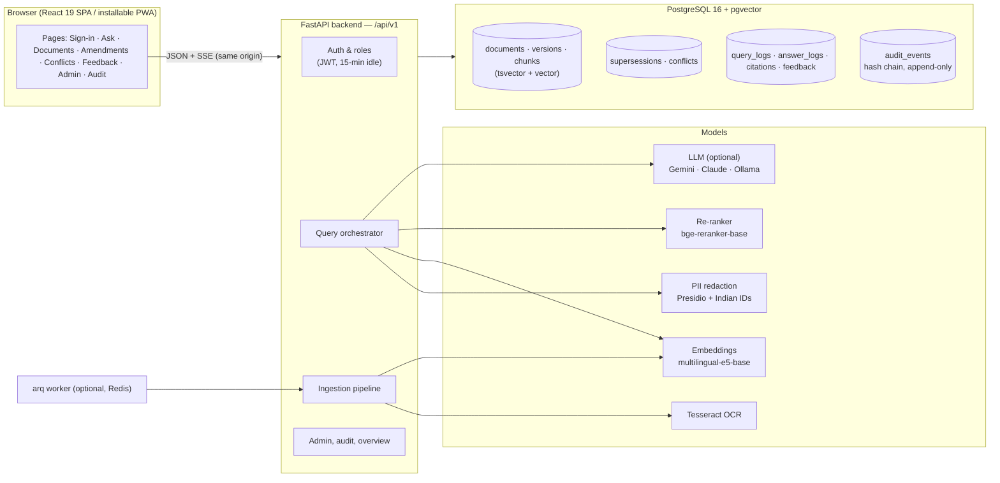
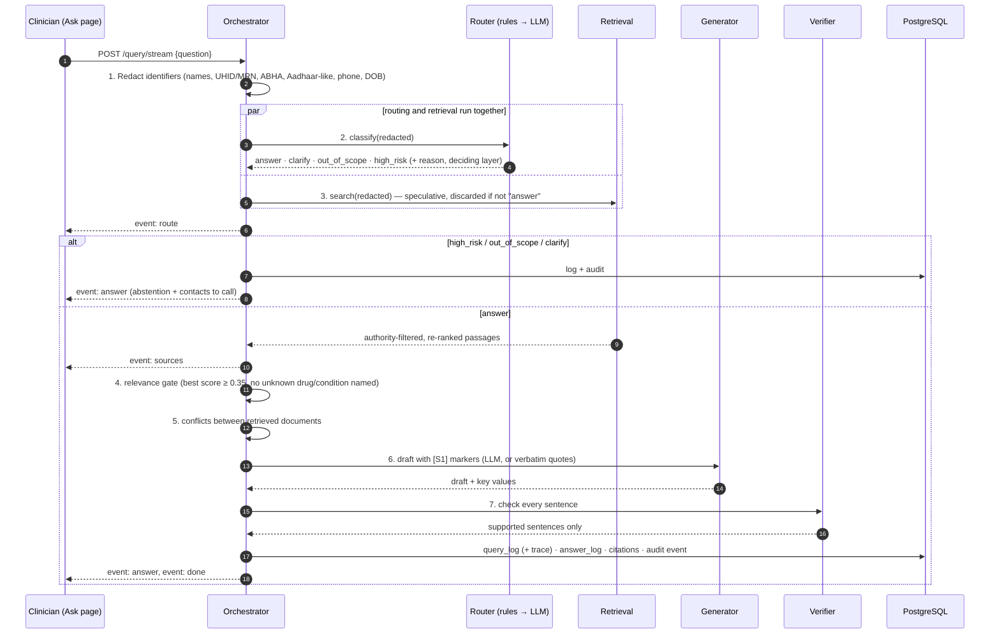
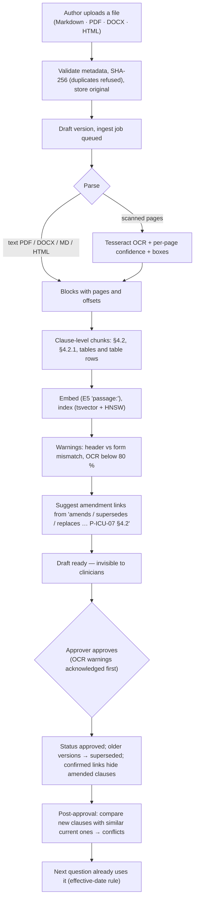
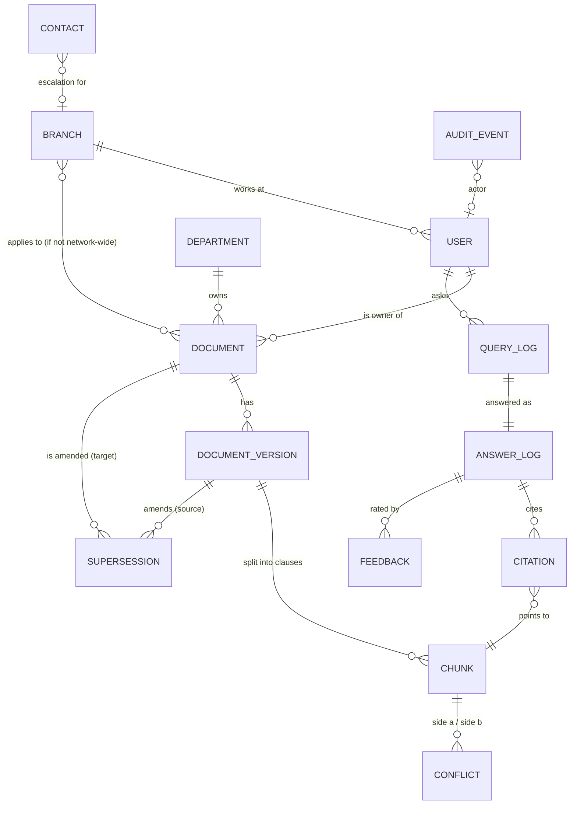

# Lumina — Architecture

Lumina answers questions from on-call hospital staff using **only approved, current institutional
documents**, and shows the exact clause, version and effective date behind every sentence. Anything
it cannot back with a source is removed; anything patient-specific is refused and escalated.

This document explains how the pieces fit together. For what each screen does, see
[USER_GUIDE.md](USER_GUIDE.md); for endpoints, [api.md](api.md).

---

## 1. System overview



| Layer | Technology | Where |
|---|---|---|
| Web app | React 19, TypeScript, Vite, Tailwind CSS v4 (design tokens in `@theme`, see [DESIGN_SYSTEM.md](DESIGN_SYSTEM.md)), TanStack Query, React Router, Radix primitives, react-pdf | `frontend/src` |
| API | Python 3.12, FastAPI, Pydantic v2, SQLAlchemy 2 (async), Alembic | `backend/app` |
| Search | PostgreSQL full-text (`websearch_to_tsquery`, `ts_rank_cd`) + pgvector (cosine, HNSW) fused with Reciprocal Rank Fusion | `backend/app/services/retrieval` |
| Models | sentence-transformers (E5 embeddings, BGE cross-encoder), Presidio + spaCy, Tesseract | `backend/app/services/{embeddings,retrieval,safety,ingestion}` |
| LLM | Provider interface with per-stage time budgets: Gemini (model fallback chains, optional Vertex region pinning), Anthropic Claude, Ollama (on-premises), or none | `backend/app/services/llm` |
| Jobs | In-process tasks by default; arq + Redis in Docker | `backend/app/services/jobs.py`, `backend/app/workers` |

**One origin.** In a demo the API also serves the built web app (`frontend/dist`) so one process is
enough; in development Vite proxies `/api` and `/docs` to the API; in Docker, nginx does.

---

## 2. Life of a question

The same pipeline serves `POST /query` (JSON) and `POST /query/stream` (server-sent events). The
answer event is only emitted **after** verification, so unverified text never reaches a browser.



### Step by step

1. **Redaction** (`services/safety/pii_redaction.py`) — Presidio NER plus Indian identifier patterns.
   A clinical vocabulary and every word in the approved corpus stop drug names being mistaken for
   people. Only the redacted text is used from here on: logs, embeddings, LLM prompts.
2. **Routing** (`services/generation/classifier.py`) — deterministic rules run first; a weight, a
   renal value, "should I give…", "calculate the dose", or a named patient is **high_risk** and the LLM
   is not consulted (it can never downgrade a rule-detected risk). Otherwise the LLM classifier decides
   between answer / clarify / out_of_scope / high_risk; without an LLM the rules decide.
3. **Retrieval** (`services/retrieval/search.py`)
   - query normalisation: approved abbreviations and brand names expanded (`Tazocin → piperacillin-tazobactam`, `MTP`, `OD/TDS`…);
   - keyword search (PostgreSQL FTS) and vector search (pgvector) over **eligible** chunks only;
   - Reciprocal Rank Fusion (k = 60);
   - **authority filter**, re-checked in Python independently of the SQL: the version must be approved
     and the document's current one, not superseded by a confirmed and effective amendment, and
     applicable to the user's branch;
   - cross-encoder re-ranking on each chunk's best window (table row, list item or sentence group);
   - small ordering boosts: the user's branch (+0.10), amending circulars (+0.05), recency (+0.02),
     passages that name the specific drug/term asked about (+0.25). Boosts reorder results but never
     pass the relevance gate.
4. **Relevance gate** — abstain as "not found" if the best re-ranker score is below `MIN_RELEVANCE`
   (0.35) or the question names a drug/condition that no document mentions.
5. **Conflicts** (`services/generation/conflicts.py`) — known open conflicts involving a retrieved
   clause pull in the other side; a heuristic finds new ones (same unit, overlapping context,
   different value) and stores them for the document owner.
6. **Generation** (`services/generation/generator.py`) — with an LLM: a JSON answer where every
   sentence ends with `[S#]` markers, plus key values. Without an LLM, or if the LLM fails or exceeds
   its time budget: **extractive mode** quotes the best-matching sentences/table rows verbatim.
7. **Verification** (`services/generation/verifier.py`) — every sentence is checked:
   uncited → removed; cites an unknown source → removed; **numeric guard**: any number not present in
   the cited passage → removed; then a judge (LLM, one batched call; or a strict lexical judge) must
   score it ≥ 0.8. Key values survive only if their value appears in the source. No supported sentence
   left → abstain.
8. **Persistence** — `query_logs` (redacted question, route, latency, model and prompt versions,
   retrieval summary, and the **trace**: route reason, deciding layer, stage timings, key terms,
   expansions), `answer_logs` (outcome, verifier summary incl. removed claims), `citations`, and one
   hash-chained audit event.

**Resilience.** Each LLM stage has a time budget (classify 6 s, generate 15 s, verify 10 s,
conflict 10 s). Past it, the stage uses its deterministic fallback (rules, verbatim quotes, lexical
judge), so a slow or rate-limited model never blocks a clinician and never lets unverified text
through. Gemini additionally rotates through a chain of models when one is rate-limited.

---

## 3. Life of a document



**Effective-version rule** (`services/ingestion/supersession.py`, mirrored in SQL in
`services/retrieval/eligibility.py`; tests keep the two in agreement): a document's current version is
its approved version with the latest `effective_from ≤ today`. A clause is hidden when a confirmed
amendment targets its section (or any parent section), the amendment is effective, and the amending
version is approved (or was approved and later replaced by its own newer version). Drafts and retired
versions never amend anything.

---

## 4. Data model



| Table | Holds |
|---|---|
| `documents`, `document_versions` | Code, title, type, owner, branches; per version: status (draft / approved / superseded / retired), effective and review dates, file hash, ingest status, OCR confidence, warnings |
| `chunks` | Clause text, section path(s), heading, pages, bounding boxes, generated `tsvector`, 768-d `vector` |
| `supersessions` | Amendment links: source version → target document (+ section), effective date, suggested/confirmed, evidence sentence |
| `conflicts` | Two chunks that disagree, how found, confidence, owner, resolution |
| `query_logs`, `answer_logs`, `citations` | Every question (redacted only), how it was routed, the answer, verifier summary, what was cited, and the per-question trace |
| `feedback` | Rating, comment, routed-to owner, status, resolution note |
| `contacts` | Escalation directory (branch, department, extension, pager, which abstention reasons) |
| `audit_events` | Append-only, hash-chained log of every action |

Migrations: `backend/app/db/migrations/versions` (`0001` schema + database guards, `0002` query trace).

---

## 5. Security and privacy

| Concern | Control |
|---|---|
| Who can see what | Four ordered roles enforced on every endpoint (`api/deps.py`); drafts return "not found" to clinicians |
| Sessions | Short JWTs (15 min idle, refreshed only while the user is active), kept in `sessionStorage`; production uses hospital SSO (OIDC) and refuses the default secret |
| Patient data | Identifiers redacted before logging, search and LLM calls; a second scrubber runs on every log line; access logs record paths only (never question text); questions travel in POST bodies, not URLs |
| Tamper evidence | `hash = sha256(prev_hash + canonical record)`, writers serialised by an advisory lock, database triggers reject UPDATE/DELETE/TRUNCATE on `audit_events`; **Check chain** re-verifies |
| Browser | Strict Content-Security-Policy (no inline scripts, same-origin API), `nosniff`, `frame-ancestors 'none'`, HSTS in production; uploaded HTML is served under `default-src 'none'` |
| Abuse | Per-user rate limit on questions (30/min, Redis or in-process) |
| Data residency | `LLM_PROVIDER=ollama` keeps inference on-premises; Gemini can be pinned to an Indian region via Vertex AI |

---

## 6. Frontend structure

```
frontend/src
├── app/
│   ├── App.tsx          Router + top-level error boundary; signed out → LoginPage, signed in → AppRoutes
│   ├── routes.tsx       The route tree: sections, role gates, lazy pages, redirects from old addresses
│   ├── paths.ts         Every address in one place (paths.library, paths.document(id), …)
│   ├── navigation.ts    Top navigation (one entry per section) and each section's tabs, per role
│   ├── providers.tsx    Auth (session keep-alive, SSO callback), React Query, toasts, tooltips
│   ├── RequireRole.tsx  Role gate for a subtree ("Not available for your role")
│   ├── ErrorBoundary.tsx, NotFoundPage.tsx
│   └── layout/          AppShell (skip link, announcement, TopNav, page, footer), SectionLayout
│                        (section tabs with queue counts), Page / PageHeader / SectionTitle, Footer
├── features/            One folder per job; a page owns its components
│   ├── auth/            Sign-in page
│   ├── ask/             Ask page, streaming hook, answer / abstain cards, citations, conflicts, feedback
│   ├── history/         Recent questions
│   ├── sources/         Source viewer (clause in document), PDF viewer (loaded on demand)
│   ├── documents/       Library list, document page, upload dialog
│   ├── supersessions/   Amendments queue + AmendmentList (also used on the document page)
│   ├── conflicts/ feedback/   Review queues
│   ├── audit/           Audit log
│   └── admin/           Insights: Overview, AI usage, record tabs, DailyChart, stat band
├── components/ui/       Design-system primitives: Button/ButtonLink, Badge/TaxonomyChip/MonoLabel,
│                        Card/Band, Dialog, Sheet, Tabs, Segmented, Table/RuleList, Field, Toast…
├── lib/
│   ├── queries.ts       Every server query (key + fetcher) declared once; mutations invalidate by key
│   ├── api.ts, sse.ts   Fetch client (auth header, typed errors) and SSE reader
│   └── auth.ts, format.ts, types.ts, api-schema.d.ts (generated)
└── styles/globals.css   Design tokens (colour, type, radius) and text utilities
```

**Conventions.** Pages never build URLs or query keys by hand: addresses come from `app/paths.ts` and
server data from `lib/queries.ts`, so a rename happens in one place and two components asking for the
same data share one request. Every page renders inside `Page` (which also sets the browser tab title)
and starts with a `PageHeader`. Pages outside Ask are code-split (`React.lazy`), and so is the PDF
viewer, which keeps the first download small for clinicians.

### Routes

| Address | Page | Role |
|---|---|---|
| `/` | Ask (sign-in page while signed out) | any |
| `/library`, `/library/:id` | Library, document | author + |
| `/review/amendments`, `/review/conflicts`, `/review/feedback` | Review queues (`/review` → amendments) | author + |
| `/admin`, `/admin/audit` | Insights, audit log | administrator |
| `/admin/documents[/:id]`, `/admin/supersessions`, `/admin/conflicts`, `/admin/feedback`, `/admin/overview`, `/admin/dashboard` | Redirects to the addresses above | — |

API types are generated from the backend's OpenAPI schema (`scripts/export_openapi.py` →
`src/lib/openapi.json` → `pnpm gen:types`); a backend test fails if the committed schema drifts.

---

## 7. Deployment options

| Option | How | Notes |
|---|---|---|
| Docker Compose | `docker compose up --build` | Postgres + Redis + API (runs migrations, seeds demo users, loads the sample corpus on first start) + arq worker + nginx web on :5173; `--profile local-llm` adds Ollama |
| Native | `uv run python -m scripts.bootstrap` then `uv run uvicorn app.main:app --port 8001`; `pnpm build` in `frontend/` | The API serves the built UI on the same port |
| Windows | `protocite.ps1` | Portable Postgres/Tesseract runtime |

Configuration is entirely environment variables — see `.env.example` (every value has a demo-safe
default).
