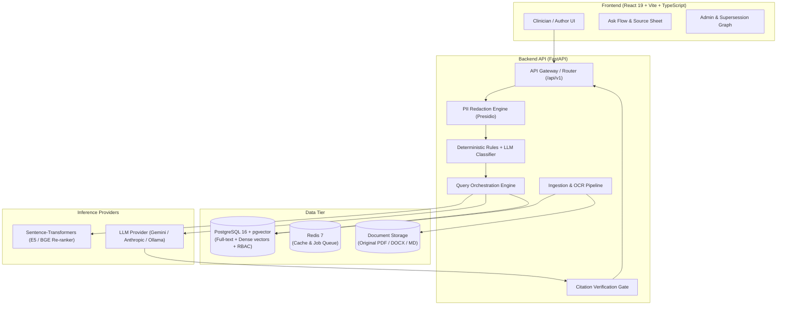
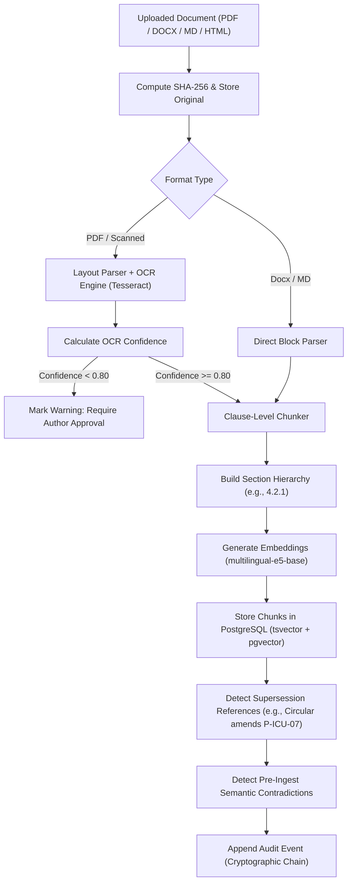
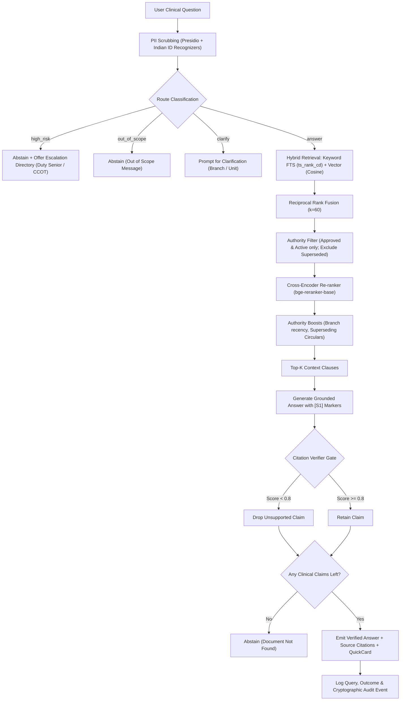

# Architecture & System Design — ProtoCite

ProtoCite is built with a decoupled architecture ensuring clinical safety, deterministic citation verification, and high performance.

---

## 1. System Overview

---

## 2. Ingestion Pipeline

---

## 3. Query Orchestration Pipeline

